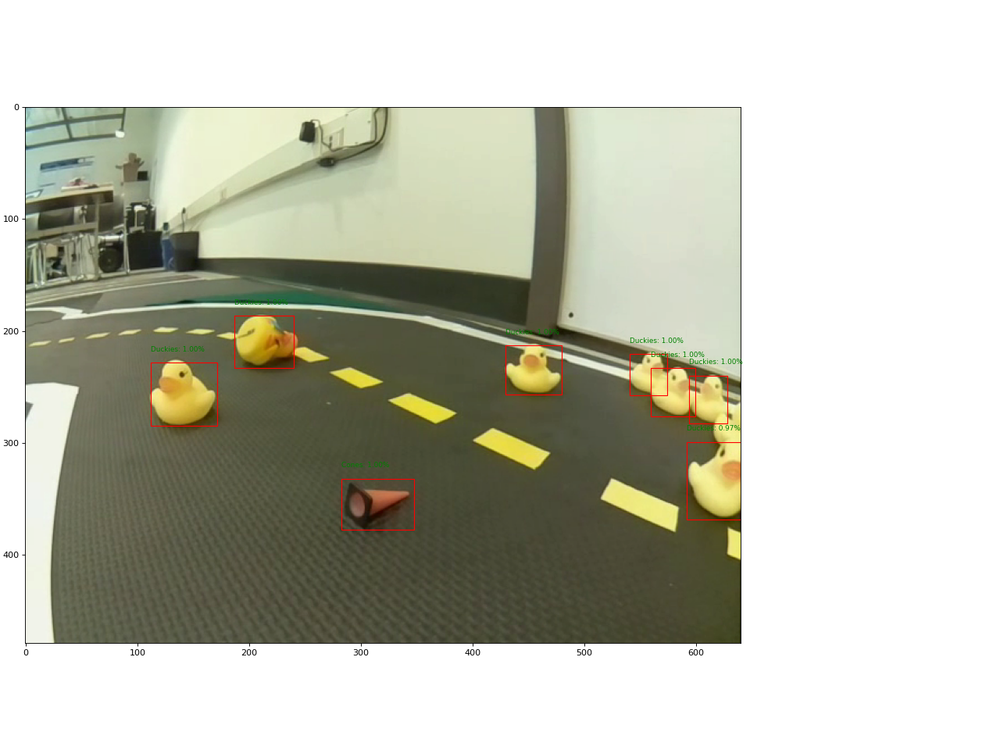

# dt-object-detection
Duckietown Project: Object Detection

This is complete object detection package for real-time object detection on duckietown stack. 

This package combine deep learning based object detector along with object tracking using Kalman Filter. 

# I see you Duckies!

Here are the online videos to watch: [Simualtor](https://vimeo.com/496162175), [Real-robot](https://vimeo.com/496162169)
## Seting-Up the Laptop

Setup your laptop using the documentation available at [duckietown-manual](https://docs.duckietown.org/daffy/opmanual_duckiebot/out/building_duckiebot_c0.html)

## Running the object detector node

### Downloading weights

You can download the weights from [drive](https://drive.google.com/drive/folders/11RFmZpG6oJDrcqzBS3_Za5iitlmGdXW3?usp=sharing) and put them in `object_detection/include/object_detection/weights`

### Building and Running

    dts exercises build
    dts exercises test -b $robot_name --local
    dts exercises test --sim

In the package `object_detection/config/default.yaml` you can specify which architecture to use, and other configuration.

After this you can see the object detection on the topic `~duckie_image`. Also you can see object location in robot frame, which can be used for planning and obstacle avoidance, see topic `~object_projection`.

### Training Faster-RCNN 

    cd utils
    python3 train.py -name $exp_name -config config.yaml -mode train

You can use the `config.yaml` which you can finf in `./include/object_detection/faster_rcnn/` to specify the datset path, weights saving path and other model hyper-parameters. The faster-rcnn code is inspired from the structure of [detectron2](https://github.com/facebookresearch/detectron2)

## Run inference on the jetson nano on Yolov5

    sudo apt-get install linux-headers-generic build-essential dkms
    sudo apt-get install libffi-dev build-essential git apt-utils 
    sudo apt-get install python-dev python-pip python3-dev python3-pip python3-venv python3-setuptools python3-pkg-resources

    pip3 install cython

Install missing libraries before using pytorch, numpy, scipy:

    sudo apt-get install gfortran libblas-dev liblapack-dev libjpeg-dev zlib1g-dev libopenblas-base libopenmpi2 

Upgrade and install these packages:

    pip3 install --upgrade numpy scipy
    pip3 install matplotlib, tqdm, Pillow

Download and Install Pytorch==1.6.0 from [this prebuilt binary for Jetpack 4.4/4.4.1](https://nvidia.box.com/shared/static/9eptse6jyly1ggt9axbja2yrmj6pbarc.whl).

Verify Pytorch installation using [these commands](https://stackoverflow.com/a/48152675/5276428).

If error comes during import, install relevant pip libraries. 
In case of missing `.so` files, use [apt-file search](https://stackoverflow.com/questions/63818421/unable-to-import-pytorch-in-jetson-nano-ubuntu) for installing missing files.

After verifying pytorch installation, install torchvision:

    git clone https://github.com/pytorch/vision.git
    cd vision
    git checkout v0.7.0
    python3 setup.py install

jetson_clocks turn on:

    sudo jetson_clocks

since `htop` is not available for nano. Use `jtop` after installing this package:

    sudo apt-get install jetson-stats 

## YOLOv5s

clone this repo on the jetson nano/raspberry pi

    git clone https://github.com/burglarhobbit/yolov5.git

Download weights

    
